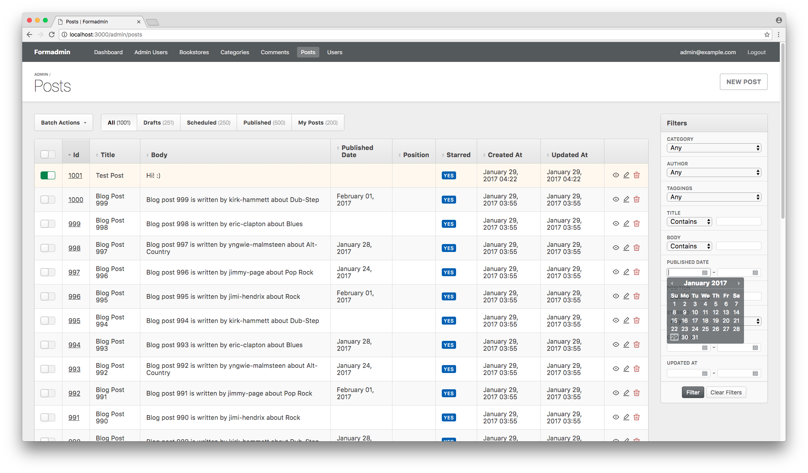
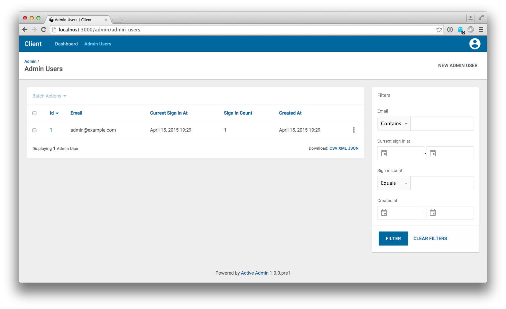
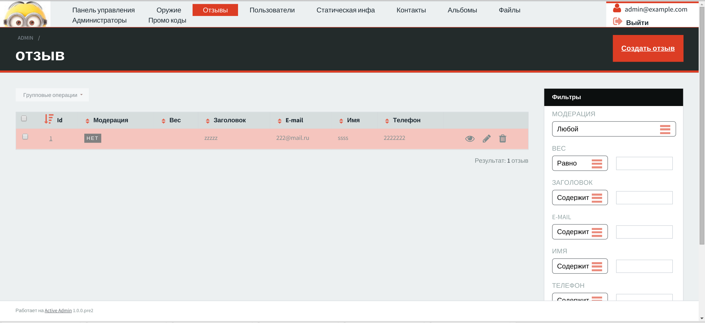
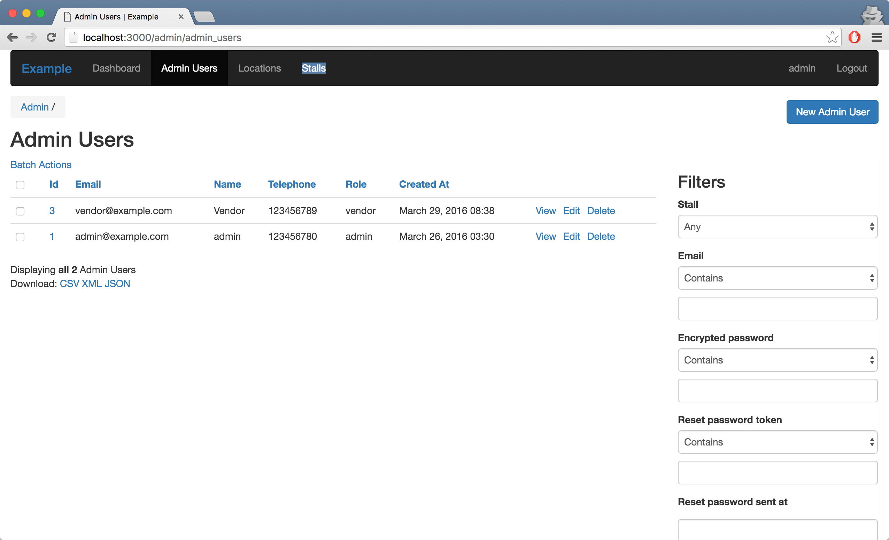
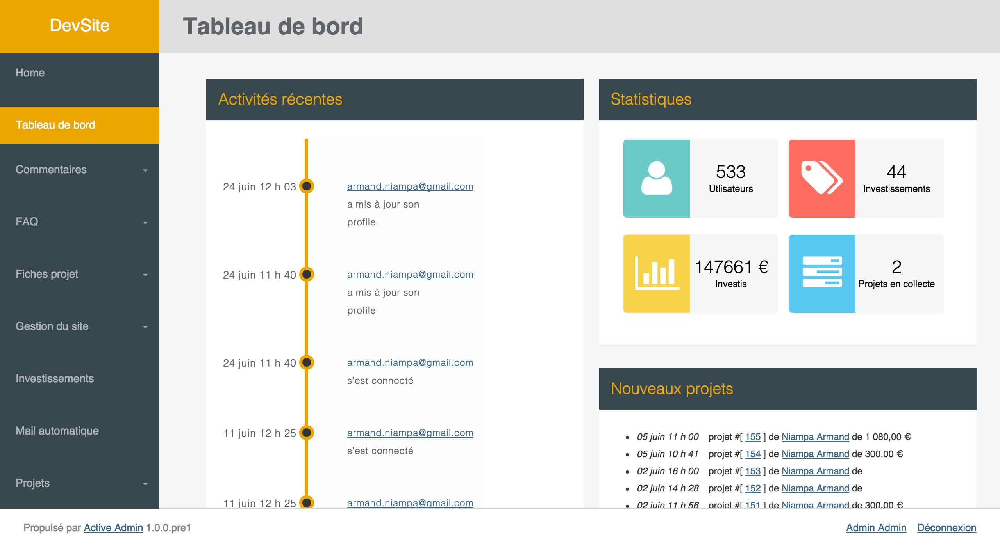

# ActiveAdmin Themes
Awesome themes for [ActiveAdmin](www.activeadmin.info). Let's take a look? :)

### [Formadmin](https://github.com/formaweb/formadmin)

### [ActiveMaterial](https://github.com/vigetlabs/active_material)

### [Active Admin Theme](https://github.com/activeadmin-plugins/active_admin_theme)

### [Active Skin](https://github.com/rstgroup/active_skin)

### [Flattened Active Admin](https://github.com/Papercloud/flattened_active_admin)

### [Face of Active Admin](https://github.com/kvokka/face_of_active_admin)

### [Active Bootstrap Skin](https://github.com/vinhnglx/active_bootstrap_skin)

### [Active Admin Flat Skin](https://github.com/ayann/active_admin_flat_skin)

### [Arctic Admin](https://github.com/cle61/arctic_admin)

## Submit a new theme
Are you developing a new theme for ActiveAdmin or have noticed some theme that isn't here? Please, make a pull request or [create a new issue](https://github.com/paladini/activeadmin-themes/issues/new) with the "New theme" tag, so I can add it here as soon as possible :)
